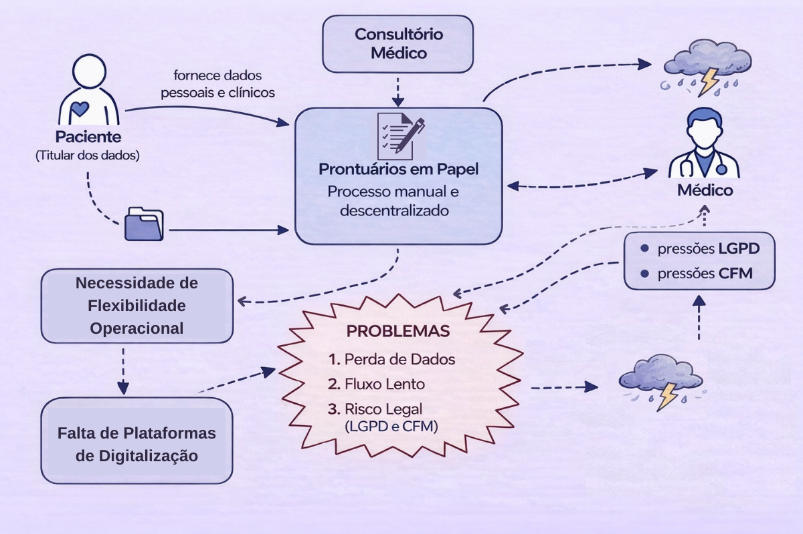
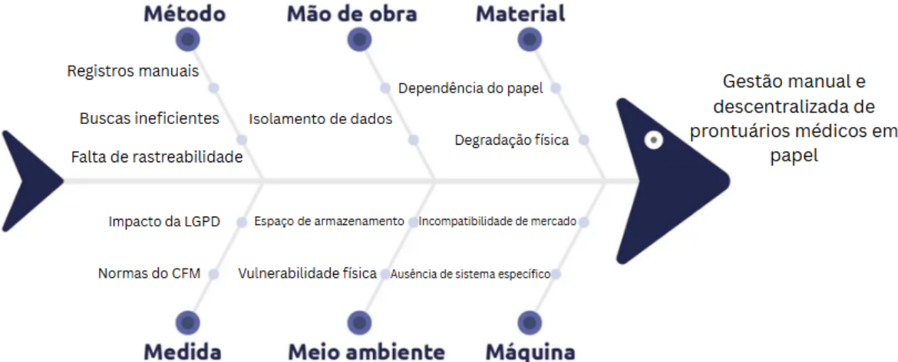

# Cenário, problema e desafios

#### 1.3 Rich Picture

O Rich Picture evidencia a tensão central entre as obrigações legais de rastreabilidade e proteção de dados sensíveis e a realidade de um processo físico e descentralizado. Atualmente, o médico opera em múltiplos contextos: consultório, domicílio e remoto, sem uma ferramenta unificada de registro, o que torna a recuperação do histórico clínico lenta e dependente de buscas manuais em arquivos de papel. Essa fragmentação operacional gera um fluxo no qual o acesso estruturado ao histórico do paciente é limitado, dificultando a continuidade assistencial em atendimentos sucessivos.

Sob a perspectiva dos envolvidos, essa fragilidade afeta diretamente o paciente, que, apesar de ser o titular legal das informações, não possui garantias de que seu histórico estará disponível, íntegro ou facilmente compartilhável com outros profissionais de saúde. Para o médico, a dependência desse fluxo manual não apenas reduz a agilidade da consulta, mas também o expõe a riscos de conformidade regulatória e falhas de segurança na guarda de documentos que devem ser preservados por décadas. Essa lacuna entre o rigor das exigências do setor e a precariedade da execução manual define a vulnerabilidade do cenário atual.

#### 1.4 Identificação da Oportunidade ou Problema

O projeto é motivado pela necessidade de mitigar a gestão manual e descentralizada de prontuários médicos em papel no cotidiano do médico autônomo. A análise das causas raízes desse cenário, detalhada no Diagrama de Ishikawa, revela os seguintes gargalos estruturados sob a ótica dos 6M's:

- **Método:** O processo clínico atual é baseado em registros manuais, o que provoca buscas ineficientes durante os atendimentos sucessivos e resulta em uma grave falta de rastreabilidade do histórico do paciente.
- **Mão de Obra:** O modelo de trabalho individual, sem o apoio de equipes auxiliares, favorece o isolamento de dados, dificultando a troca de informações clínicas seguras com outros profissionais.
- **Material:** O consultório sofre com a extrema dependência do papel como principal insumo para o registro, material este que está constantemente sujeito à degradação física com o passar dos anos.
- **Medida:** Os processos de controle do consultório são fortemente pressionados pelo impacto da LGPD e pelas rigorosas normas do CFM, que exigem garantias de privacidade e guarda documental muito difíceis de serem mensuradas e asseguradas no formato físico.
- **Meio Ambiente:** O ambiente do consultório impõe severas limitações de espaço de armazenamento para o arquivo de décadas de prontuários, aumentando a vulnerabilidade física do acervo a perdas, furtos ou danos.
- **Máquina:** Há uma clara ausência de sistema específico que atenda à realidade itinerante do médico autônomo, o que reflete uma incompatibilidade de mercado das ferramentas atuais, que geralmente são engessadas ou desenhadas para grandes hospitais.

#### 1.5 Desafios do Projeto

O principal desafio técnico do projeto consiste em assegurar que a transição do ambiente físico para o digital ocorra sem prejuízo à continuidade assistencial do consultório. Nesse sentido, durante a migração, deve-se evitar qualquer perda, indisponibilidade ou inconsistência de informações históricas relevantes à segurança do paciente. Sob a perspectiva operacional, observa-se que o médico adota há anos uma rotina de atendimento fortemente apoiada em registros em papel. Por isso, a interface do ProntoCare deverá apresentar elevado grau de facilidade na interação e usabilidade, de modo a viabilizar a adaptação ao sistema sem comprometer a fluidez dos atendimentos e sem demandar treinamento formal extensivo.

Adicionalmente, o projeto está condicionado a um cronograma acadêmico fixo e à diretriz de priorização de soluções com custo zero de licenciamento. Ainda assim, tal diretriz não exclui a possibilidade de, mediante comum acordo com o cliente, serem incorporados componentes ou serviços que impliquem custo, desde que devidamente justificados. O escopo será definido com base em critérios rigorosos de priorização, contemplando exclusivamente as funcionalidades essenciais ao funcionamento do consultório.

#### Histórico de Revisões

| Data | Versão | Descrição | Autor |
| :---: | :---: | :---: | :---: |
| 2026-02-10 | 0.1 | Elaboração inicial da visão do produto e projeto. | Prontuariantes |
| 2026-02-24 | 0.2 | Refinamento do escopo após reuniões de elicitação com o cliente. | Prontuariantes |
| 2026-03-10 | 0.3 | Definição da arquitetura documental e cadeia de autenticidade. | Prontuariantes |
| 2026-03-25 | 0.4 | Delimitação do escopo reduzido do MVP e revisão geral. | Prontuariantes |
| 2026-04-11 | 0.5 | Correções conforme revisão do professor; inclusão das seções 2.4 a 6. | Prontuariantes |
| 2026-04-13 | 0.6 | Últimas revisões antes da primeira entrega. | Prontuariantes |
