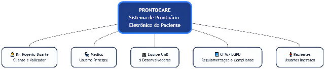
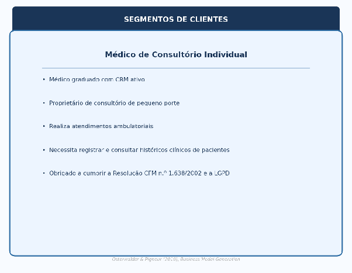

# Stakeholders e segmentação

#### 1.6 Mapa de Stakeholders

(1) **Médico cliente (Dr. Rogério Duarte)** — valida requisitos, prioridades e entregas; principal decisor e usuário primário do sistema. (2) **Pacientes** — acesso restrito ao próprio prontuário; podem encaminhar dados a outros profissionais. (3) **Outros profissionais de saúde** — destinatários de dados encaminhados pelo paciente. (4) **Equipe de desenvolvimento (Prontuariantes)** — implementa e refina escopo ao longo das sprints. (5) **Professor orientador (George Marsicano)** — valida escopo, processo e viabilidade acadêmica. (6) **Monitor (Willian)** — apoia a equipe no processo e nas entregas da disciplina. Clínicas são stakeholders potenciais futuros, fora do escopo do MVP.

#### 1.7 Segmentação de Clientes

O ProntoCare atende a três segmentos distintos de usuários e clientes: (1) **Segmento primário — médico autônomo:** profissional graduado com CRM ativo que é, simultaneamente, o cliente que comissiona o produto, o usuário primário da solução e o principal decisor quanto à priorização de funcionalidades e à validação das entregas. Opera consultório de pequeno porte, realiza atendimentos ambulatoriais e, atualmente, mantém os registros clínicos em fichas de papel. Demanda solução capaz de apoiar seu fluxo operacional clínico de forma segura, eficiente e compatível com as exigências regulatórias aplicáveis. (2) **Segmento secundário — paciente:** pessoa atendida pelo médico que possui acesso restrito ao próprio prontuário e pode encaminhar seus dados a outros profissionais de saúde. Não é o comprador do sistema, mas é diretamente impactado pela qualidade, segurança e organização dos registros. (3) **Segmento potencial futuro — clínicas e serviços de saúde:** ambientes com múltiplos profissionais que poderiam utilizar o produto em versões futuras. Fora do escopo do MVP e do ciclo acadêmico atual.

**
